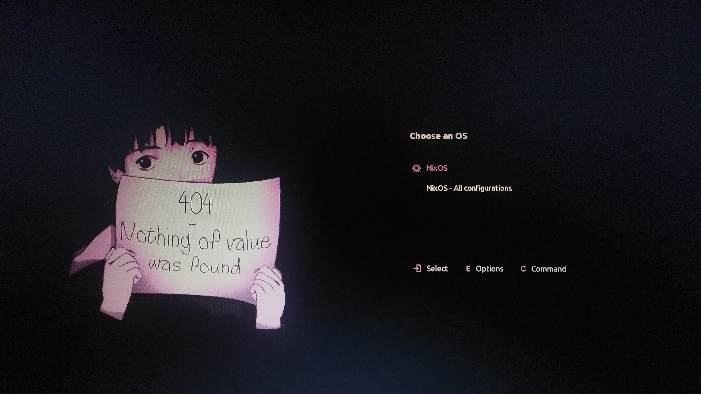

Grub theme is a nice way to make unique appearance of your boot screen.
There are quite many of cool available themes [out there](https://github.com/Jacksaur/Gorgeous-GRUB), but how do we install them?
After all, NixOS takes a different approach in system configuration. If you just download and put the theme in /boot imperatively, then set the theme in `grub.cfg`, it will work until the next NixOS generation will substitute your current one. `grub.cfg` file is updated every `switch`, because NixOS has to add new generation entries to it, subsequently overwriting all the imperative changes you introduced to the file. We have to express this piece of configuration declaratively.

Luckily NixOS provides a simple option for that:

{{< nixos-option
  name="boot.loader.grub.theme"
  type="`null or absolute path`"
  default="null"
  example="${pkgs.kdePackages.breeze-grub}/grub/themes/breeze"
  declared_in="nixos/modules/system/boot/loader/grub/grub.nix"
  source="https://github.com/NixOS/nixpkgs/blob/nixos-unstable/nixos/modules/system/boot/loader/grub/grub.nix"
>}}
Path to the grub theme to be used.


Unluckily however, nixpkgs doesn't contain much of grub themes, I've counted maybe 2 or 3 in total.
So, what do we do? Of course, we package it ourselves!

### Packaging Grub Themes

Grub themes aren't hard to package. Most of the time it's just one directory that needs to be copied. As an example, let's package this [Lain Grub Theme](https://github.com/uiriansan/LainGrubTheme).

Just from the file tree we can see the __`lain`__ directory standing aside. This is the directory that we need in our package, because it contains the essential __`theme.txt`__ file. We start by writing the derivation in a separate file:

```nix
# grub-theme.nix

{stdenv, fetchFromGitHub}: stdenv.mkDerivation {
  pname = "lain-grub-theme"; # you can set any
  version = "unstable-2026"; # optional, but nice to have

  src = fetchFromGitHub {
    owner = "uiriansan";
    repo = "LainGrubTheme";
    tag = "1.0.1";
    hash = "sha256-gDwNolJ28UQUjE2G2U0bvzh29E9EEiet9SlItbY46IQ=";
  };
}
```

To fetch the source we use fetchFromGitHub function, requiring 4 arguments: owner, repo, tag (or revision), and a hash. Owner and repo are obvious. What about the tag? In this case developer of the theme published a release with the tag `1.0.1`, so we can specify this one. However, often developers don't have any release on their repos, meaning we have to specify the revision. For those cases we can use [`nix-prefetch-github`](https://search.nixos.org/packages?channel=unstable&query=nix-prefetch-github&show=nix-prefetch-github) package from nixpkgs. Just run:
```bash
nix-shell -p nix-prefetch-github --command "nix-prefetch-github <owner> <repo>"
```

```bash
> nix-shell -p nix-prefetch-github --command "nix-prefetch-github uiriansan LainGrubTheme"

{
    "owner": "uiriansan",
    "repo": "LainGrubTheme",
    "rev": "1cf38e3b46e26cfd9166613bb49669f27efab12c",
    "hash": "sha256-gDwNolJ28UQUjE2G2U0bvzh29E9EEiet9SlItbY46IQ="
}
```
This way we get both the revision and the hash, which we can copy to our package definition.

Now all is left is to write the `installPhase`. And it's just simple copy command:
```nix
# grub-theme.nix

{stdenv, fetchFromGitHub}: stdenv.mkDerivation {
  pname = "lain-grub-theme"; # you can set any
  version = "unstable-2026"; # optional, but nice to have

  src = fetchFromGitHub {
    owner = "uiriansan";
    repo = "LainGrubTheme";
    tag = "1.0.1";
    hash = "sha256-gDwNolJ28UQUjE2G2U0bvzh29E9EEiet9SlItbY46IQ=";
  };

  # just copying the theme directory to $out (result path)
  installPhase = ''
    cp -r lain $out
  '';
}
```

And it's ready. Now, how do we use this package?

```nix
# configuration.nix

{pkgs, ...}: {
  boot.loader.grub = {
    enable = true;

    # we specify the relative path to the package we want to call
    theme = pkgs.callPackage ./grub-theme.nix { };
  };
}
```

### Dendritic approach
If you use [dendritic approach](https://github.com/mightyiam/dendritic) however, there is a more elegant way to express that.
Just specify the package name in perSystem block and call the package.
```nix
{
  inputs = {...};

  outputs = inputs@{...}:
  inputs.flake-parts.lib.mkFlake {inherit inputs; } {
    systems = [ "x86_64-linux" "aarch64-linux" ];

    perSystem = {pkgs, ...}: {
      packages.lain-grub-theme = pkgs.callPackage ./grub-theme.nix;
    };
  }
}
```

If you use[import-tree](https://github.com/vic/import-tree), importing all the nix files inside your configuration directory, you can have a separate file with perSystem block defining our package:
```nix
{
  perSystem =
    {
      pkgs,
      ...
    }:
    {
      packages.lain-grub-theme = pkgs.stdenv.mkDerivation {
        pname = "lain-grub-theme";
        version = "unstable-2026";

        src = pkgs.fetchFromGitHub {
          owner = "uiriansan";
          repo = "LainGrubTheme";
          tag = "1.0.1";
          hash = "sha256-gDwNolJ28UQUjE2G2U0bvzh29E9EEiet9SlItbY46IQ=";
        };

        installPhase = ''
          cp -r lain $out
        '';
      };
    };
}
```

All that's left is to specify the theme by referencing the self parameter:
```nix
{self, ...}:
{
  flake.nixosModules.grub = {pkgs, ...}: {
    boot.loader.grub = {
      enable = true;
      theme = self.packages.${pkgs.system}.lain-grub-theme;
    };
  };
}
```

And just like that, we packaged our grub theme, which will be with our system forewer.
